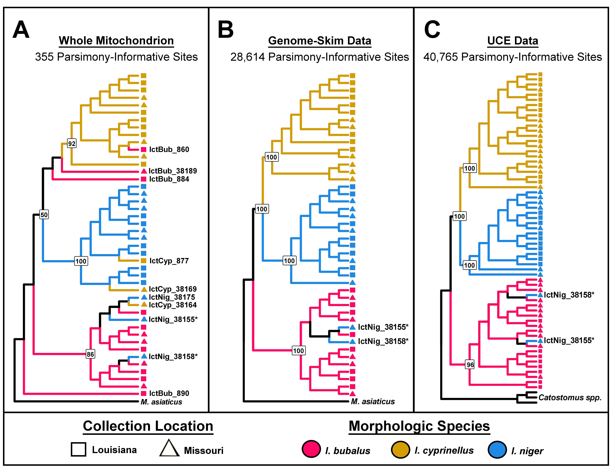
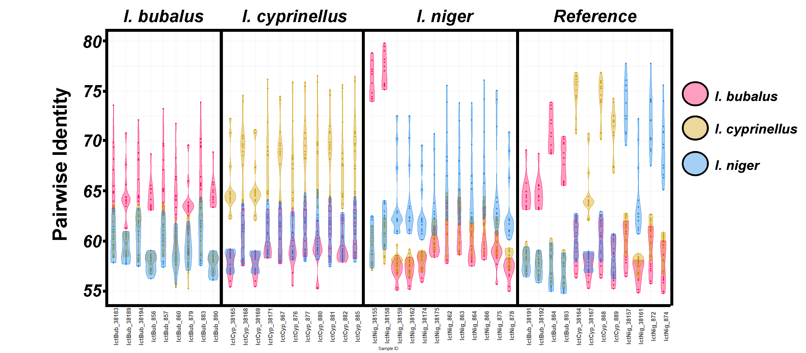
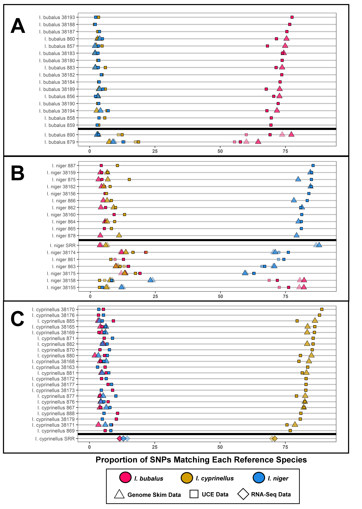

### Using Low-Coverage Whole Genome Sequencing (Genome Skimming) to Delineate Three Introgressed Species of Buffalofish (Ictiobus)

Robert Literman, Amanda M. Windsor, Henry L. Bart Jr., Elizabeth Sage Hunter, Jonathan R. Deeds and Sara M. Handy

#### Project Goal
The aim of this study was to develop nuclear DNA markers to facilitate the delineation of three sympatric species of *Ictiobus*: *Ictiobus bubalus*, *Ictiobus cyprinellus*, and *Ictiobus niger*. Consumption of buffalofish is associated with intermittent cases of buffalofish poisoning (i.e. Haff's Disease). In the absence of a reference genome for the group, historical attempts to differentiate these species using DNA has been problematic. Here, we apply the SISRS bioinformatics pipeline to generate 620Mbp of putatively orthologous nuclear data for the group, and isolate over 140,000 single-nucleotide polymorphisms (SNPs) that are well-suited for species delineation. 

#### Read Data  

Data for this study came from multiple sources:  
1. Low-coverage whole-genome sequencing (WGS) data for *Ictiobus* sequenced as part of this study (i.e. 'Genome Skims')
2. WGS data for *Ictibous niger* from [Stout et al. 2016](https://link.springer.com/article/10.1186/s12862-016-0819-5)
3. RNA-seq data for *Ictiobus cyprinellus* from [Ge et al. 2021](https://www.frontiersin.org/articles/10.3389/fmars.2021.736188/full)
4. WGS data for *Myxocyprinus asiaticus* from [Krabbenhoft et al. 2021](https://academic.oup.com/gbe/article/13/9/evab190/6349175)
5. UCE data collected using the myBaits UCE Actinopterygians 0.5Kv1 panel
6. UCE data for *Catostomus* species from [Stout et al. 2016](https://link.springer.com/article/10.1186/s12862-016-0819-5)

| Sample      | Species_of_Record | State_of_Catch | SISRS_ID      | Data_Type | Raw_Bases       | Trim_Bases      | Percent_Surviving |
|-------------|-------------------|----------------|---------------|-----------|-----------------|-----------------|-------------------|
| 38180       | IctBub            | Missouri       | IctBub_38180  | UCE       | 451,676,288     | 426,609,053     | 94.5%             |
| 38182       | IctBub            | Missouri       | IctBub_38182  | UCE       | 825,189,066     | 779,037,453     | 94.4%             |
| 38183       | IctBub            | Missouri       | IctBub_38183  | UCE       | 386,447,968     | 334,088,278     | 86.5%             |
| 38184       | IctBub            | Missouri       | IctBub_38184  | UCE       | 824,537,871     | 786,400,743     | 95.4%             |
| 38187       | IctBub            | Missouri       | IctBub_38187  | UCE       | 890,300,645     | 847,156,328     | 95.2%             |
| 38188       | IctBub            | Missouri       | IctBub_38188  | UCE       | 359,728,624     | 338,922,811     | 94.2%             |
| 38189       | IctBub            | Missouri       | IctBub_38189  | UCE       | 136,559,342     | 123,188,581     | 90.2%             |
| 38190       | IctBub            | Missouri       | IctBub_38190  | UCE       | 805,256,271     | 764,006,701     | 94.9%             |
| 38191       | IctBub            | Missouri       | IctBub_38191  | UCE       | 345,432,176     | 326,017,879     | 94.4%             |
| 38192       | IctBub            | Missouri       | IctBub_38192  | UCE       | 198,004,260     | 141,354,031     | 71.4%             |
| 38193       | IctBub            | Missouri       | IctBub_38193  | UCE       | 384,557,965     | 363,302,422     | 94.5%             |
| 38194       | IctBub            | Missouri       | IctBub_38194  | UCE       | 513,689,755     | 394,525,073     | 76.8%             |
| 856         | IctBub            | Louisiana      | IctBub_856    | UCE       | 229,149,671     | 167,351,483     | 73.0%             |
| 857         | IctBub            | Louisiana      | IctBub_857    | UCE       | 102,262,493     | 89,110,404      | 87.1%             |
| 858         | IctBub            | Louisiana      | IctBub_858    | UCE       | 155,920,385     | 140,316,901     | 90.0%             |
| 859         | IctBub            | Louisiana      | IctBub_859    | UCE       | 153,931,377     | 136,005,832     | 88.4%             |
| 860         | IctBub            | Louisiana      | IctBub_860    | UCE       | 114,038,311     | 98,663,679      | 86.5%             |
| 879         | IctBub            | Louisiana      | IctBub_879    | UCE       | 82,849,976      | 64,143,963      | 77.4%             |
| 883         | IctBub            | Louisiana      | IctBub_883    | UCE       | 309,314,908     | 262,927,474     | 85.0%             |
| 890         | IctBub            | Louisiana      | IctBub_890    | UCE       | 93,542,905      | 70,252,578      | 75.1%             |
| 38163       | IctCyp            | Missouri       | IctCyp_38163  | UCE       | 430,444,804     | 401,592,173     | 93.3%             |
| 38164       | IctCyp            | Missouri       | IctCyp_38164  | UCE       | 339,458,124     | 310,641,960     | 91.5%             |
| 38165       | IctCyp            | Missouri       | IctCyp_38165  | UCE       | 402,278,187     | 374,159,969     | 93.0%             |
| 38168       | IctCyp            | Missouri       | IctCyp_38168  | UCE       | 213,517,609     | 185,982,391     | 87.1%             |
| 38169       | IctCyp            | Missouri       | IctCyp_38169  | UCE       | 523,854,683     | 492,047,865     | 93.9%             |
| 38170       | IctCyp            | Missouri       | IctCyp_38170  | UCE       | 582,804,655     | 543,353,746     | 93.2%             |
| 38171       | IctCyp            | Missouri       | IctCyp_38171  | UCE       | 367,104,173     | 332,998,234     | 90.7%             |
| 38172       | IctCyp            | Missouri       | IctCyp_38172  | UCE       | 65,227,334      | 58,063,269      | 89.0%             |
| 38173       | IctCyp            | Missouri       | IctCyp_38173  | UCE       | 582,508,554     | 543,759,517     | 93.3%             |
| 38176       | IctCyp            | Missouri       | IctCyp_38176  | UCE       | 670,875,929     | 631,524,081     | 94.1%             |
| 38177       | IctCyp            | Missouri       | IctCyp_38177  | UCE       | 441,024,814     | 410,492,315     | 93.1%             |
| 38179       | IctCyp            | Missouri       | IctCyp_38179  | UCE       | 391,284,588     | 365,903,647     | 93.5%             |
| 867         | IctCyp            | Louisiana      | IctCyp_867    | UCE       | 224,757,183     | 173,203,403     | 77.1%             |
| 869         | IctCyp            | Louisiana      | IctCyp_869    | UCE       | 146,227,698     | 133,259,408     | 91.1%             |
| 870         | IctCyp            | Louisiana      | IctCyp_870    | UCE       | 377,175,939     | 333,736,352     | 88.5%             |
| 871         | IctCyp            | Louisiana      | IctCyp_871    | UCE       | 47,414,695      | 39,434,277      | 83.2%             |
| 876         | IctCyp            | Louisiana      | IctCyp_876    | UCE       | 86,142,169      | 64,706,663      | 75.1%             |
| 877         | IctCyp            | Louisiana      | IctCyp_877    | UCE       | 24,692,017      | 18,488,028      | 74.9%             |
| 880         | IctCyp            | Louisiana      | IctCyp_880    | UCE       | 187,669,556     | 158,340,744     | 84.4%             |
| 881         | IctCyp            | Louisiana      | IctCyp_881    | UCE       | 366,110,106     | 326,693,399     | 89.2%             |
| 882         | IctCyp            | Louisiana      | IctCyp_882    | UCE       | 113,977,285     | 88,029,620      | 77.2%             |
| 885         | IctCyp            | Louisiana      | IctCyp_885    | UCE       | 359,588,010     | 278,457,954     | 77.4%             |
| 888         | IctCyp            | Louisiana      | IctCyp_888    | UCE       | 116,591,231     | 102,819,014     | 88.2%             |
| 38155       | IctNig            | Missouri       | IctNig_38155  | UCE       | 859,856,227     | 817,712,807     | 95.1%             |
| 38156       | IctNig            | Missouri       | IctNig_38156  | UCE       | 1,162,820,962   | 1,108,043,429   | 95.3%             |
| 38158       | IctNig            | Missouri       | IctNig_38158  | UCE       | 502,095,411     | 476,534,159     | 94.9%             |
| 38159       | IctNig            | Missouri       | IctNig_38159  | UCE       | 759,813,374     | 716,538,775     | 94.3%             |
| 38160       | IctNig            | Missouri       | IctNig_38160  | UCE       | 425,110,490     | 401,301,201     | 94.4%             |
| 38161       | IctNig            | Missouri       | IctNig_38161  | UCE       | 347,455,091     | 329,089,780     | 94.7%             |
| 38162       | IctNig            | Missouri       | IctNig_38162  | UCE       | 321,515,457     | 302,478,050     | 94.1%             |
| 38174       | IctNig            | Missouri       | IctNig_38174  | UCE       | 431,994,135     | 408,715,108     | 94.6%             |
| 38175       | IctNig            | Missouri       | IctNig_38175  | UCE       | 456,773,827     | 414,055,936     | 90.6%             |
| 861         | IctNig            | Louisiana      | IctNig_861    | UCE       | 107,800,309     | 94,542,233      | 87.7%             |
| 862         | IctNig            | Louisiana      | IctNig_862    | UCE       | 267,686,985     | 231,789,083     | 86.6%             |
| 863         | IctNig            | Louisiana      | IctNig_863    | UCE       | 245,855,862     | 177,544,210     | 72.2%             |
| 864         | IctNig            | Louisiana      | IctNig_864    | UCE       | 337,688,583     | 313,630,950     | 92.9%             |
| 865         | IctNig            | Louisiana      | IctNig_865    | UCE       | 194,037,199     | 144,626,040     | 74.5%             |
| 866         | IctNig            | Louisiana      | IctNig_866    | UCE       | 137,486,775     | 118,119,481     | 85.9%             |
| 872         | IctNig            | Louisiana      | IctNig_872    | UCE       | 123,338,540     | 109,471,175     | 88.8%             |
| 874         | IctNig            | Louisiana      | IctNig_874    | UCE       | 97,199,570      | 84,266,361      | 86.7%             |
| 875         | IctNig            | Louisiana      | IctNig_875    | UCE       | 170,476,614     | 150,406,274     | 88.2%             |
| 887         | IctNig            | Louisiana      | IctNig_887    | UCE       | 151,528,922     | 131,999,996     | 87.1%             |
| SRR4578778  | CatLeo            | NA             | CatLeo        | WGS       | 999,018,000     | 953,680,541     | 95.5%             |
| SRR4578730  | CatPle            | NA             | CatPle        | WGS       | 925,925,400     | 886,884,039     | 95.8%             |
| SRR4578779  | CatWig            | NA             | CatWig        | WGS       | 1,081,707,000   | 1,040,271,534   | 96.2%             |
| 38183       | IctBub            | Missouri       | IctBub_38183  | WGS       | 271,222,338     | 248,706,918     | 91.7%             |
| 38189       | IctBub            | Missouri       | IctBub_38189  | WGS       | 348,089,562     | 330,380,014     | 94.9%             |
| 38191       | IctBub            | Missouri       | IctBub_38191  | WGS       | 899,823,496     | 846,068,528     | 94.0%             |
| 38192       | IctBub            | Missouri       | IctBub_38192  | WGS       | 1,316,599,200   | 1,253,914,264   | 95.2%             |
| 38194       | IctBub            | Missouri       | IctBub_38194  | WGS       | 545,983,804     | 498,915,891     | 91.4%             |
| 856         | IctBub            | Louisiana      | IctBub_856    | WGS       | 838,444,714     | 807,929,347     | 96.4%             |
| 857         | IctBub            | Louisiana      | IctBub_857    | WGS       | 326,893,402     | 287,328,818     | 87.9%             |
| 860         | IctBub            | Louisiana      | IctBub_860    | WGS       | 76,063,303      | 67,316,212      | 88.5%             |
| 879         | IctBub            | Louisiana      | IctBub_879    | WGS       | 113,544,813     | 96,458,012      | 85.0%             |
| 883         | IctBub            | Louisiana      | IctBub_883    | WGS       | 879,314,458     | 593,477,019     | 67.5%             |
| 884         | IctBub            | Louisiana      | IctBub_884    | WGS       | 8,802,989,209   | 8,347,149,126   | 94.8%             |
| 890         | IctBub            | Louisiana      | IctBub_890    | WGS       | 1,031,868,768   | 1,010,138,277   | 97.9%             |
| 893         | IctBub            | Louisiana      | IctBub_893    | WGS       | 4,741,551,507   | 4,488,713,691   | 94.7%             |
| 38164       | IctCyp            | Louisiana      | IctCyp_38164  | WGS       | 17,863,230,300  | 17,065,989,531  | 95.5%             |
| 38165       | IctCyp            | Louisiana      | IctCyp_38165  | WGS       | 1,090,704,106   | 1,049,596,322   | 96.2%             |
| 38167       | IctCyp            | Louisiana      | IctCyp_38167  | WGS       | 1,236,938,546   | 1,176,053,375   | 95.1%             |
| 38168       | IctCyp            | Louisiana      | IctCyp_38168  | WGS       | 1,559,256,862   | 1,452,841,469   | 93.2%             |
| 38169       | IctCyp            | Louisiana      | IctCyp_38169  | WGS       | 1,116,138,546   | 1,058,674,792   | 94.9%             |
| 38171       | IctCyp            | Louisiana      | IctCyp_38171  | WGS       | 215,057,461     | 193,904,893     | 90.2%             |
| 867         | IctCyp            | Louisiana      | IctCyp_867    | WGS       | 979,355,131     | 857,035,866     | 87.5%             |
| 868         | IctCyp            | Louisiana      | IctCyp_868    | WGS       | 19,060,548,000  | 18,218,707,782  | 95.6%             |
| 876         | IctCyp            | Louisiana      | IctCyp_876    | WGS       | 251,164,224     | 152,612,862     | 60.8%             |
| 877         | IctCyp            | Louisiana      | IctCyp_877    | WGS       | 717,381,784     | 653,089,563     | 91.0%             |
| 880         | IctCyp            | Louisiana      | IctCyp_880    | WGS       | 81,659,281      | 46,525,661      | 57.0%             |
| 881         | IctCyp            | Louisiana      | IctCyp_881    | WGS       | 977,471,321     | 901,328,467     | 92.2%             |
| 882         | IctCyp            | Louisiana      | IctCyp_882    | WGS       | 229,292,955     | 204,784,835     | 89.3%             |
| 885         | IctCyp            | Louisiana      | IctCyp_885    | WGS       | 542,095,776     | 501,974,586     | 92.6%             |
| 889         | IctCyp            | Louisiana      | IctCyp_889    | WGS       | 8,165,584,375   | 7,668,603,997   | 93.9%             |
| SRR14126266 | IctCyp            | NA             | IctCyp_SRR    | RNA-Seq   | NA              | 27,752,703,720  | NA                |
| 38155       | IctNig            | Missouri       | IctNig_38155L | WGS       | 4,202,577,641   | 4,036,860,102   | 96.1%             |
| 38155       | IctNig            | Missouri       | IctNig_38155R | WGS       | 18,507,612,000  | 17,629,491,003  | 95.3%             |
| 38157       | IctNig            | Missouri       | IctNig_38157L | WGS       | 4,689,890,746   | 4,472,108,244   | 95.4%             |
| 38157       | IctNig            | Missouri       | IctNig_38157R | WGS       | 17,351,787,600  | 16,914,870,797  | 97.5%             |
| 38158       | IctNig            | Missouri       | IctNig_38158L | WGS       | 20,106,994,200  | 19,106,402,755  | 95.0%             |
| 38158       | IctNig            | Missouri       | IctNig_38158R | WGS       | 12,824,494,500  | 12,038,384,388  | 93.9%             |
| 38159       | IctNig            | Missouri       | IctNig_38159  | WGS       | 915,613,264     | 867,154,190     | 94.7%             |
| 38161       | IctNig            | Missouri       | IctNig_38161  | WGS       | 1,469,293,420   | 1,353,842,731   | 92.1%             |
| 38162       | IctNig            | Missouri       | IctNig_38162  | WGS       | 1,117,091,960   | 1,053,083,429   | 94.3%             |
| 38174       | IctNig            | Missouri       | IctNig_38174  | WGS       | 1,395,762,460   | 1,325,873,423   | 95.0%             |
| 38175       | IctNig            | Missouri       | IctNig_38175  | WGS       | 409,177,660     | 384,152,137     | 93.9%             |
| 862         | IctNig            | Louisiana      | IctNig_862    | WGS       | 968,596,038     | 888,011,721     | 91.7%             |
| 863         | IctNig            | Louisiana      | IctNig_863    | WGS       | 885,468,030     | 816,731,298     | 92.2%             |
| 864         | IctNig            | Louisiana      | IctNig_864    | WGS       | 648,945,294     | 591,169,947     | 91.1%             |
| 866         | IctNig            | Louisiana      | IctNig_866    | WGS       | 441,265,569     | 404,515,348     | 91.7%             |
| 872         | IctNig            | Louisiana      | IctNig_872    | WGS       | 16,379,452,500  | 16,015,406,424  | 97.8%             |
| 874         | IctNig            | Louisiana      | IctNig_874    | WGS       | 9,035,985,543   | 8,588,642,707   | 95.0%             |
| 875         | IctNig            | Louisiana      | IctNig_875    | WGS       | 193,726,842     | 173,696,995     | 89.7%             |
| 878         | IctNig            | Louisiana      | IctNig_878    | WGS       | 1,030,504,634   | 970,007,734     | 94.1%             |
| SRR4578728  | IctNig            | NA             | IctNig_SRR    | WGS       | 853,556,400     | 815,697,301     | 95.6%             |
| SRR14863584 | MyxAsi            | NA             | MyxAsi_1      | WGS       | 100,100,035,200 | 99,203,753,211  | 99.1%             |
| SRR14863585 | MyxAsi            | NA             | MyxAsi_2      | WGS       | 102,203,197,500 | 101,310,062,942 | 99.1%             |

#### Generating Mitochondrial Assemblies to Enrich Nuclear Read Data

In order to focus on nuclear data, we used [getOrganelle](https://genomebiology.biomedcentral.com/articles/10.1186/s13059-020-02154-5) to assemble complete or partial mitochondrial assemblies for all WGS data. 

```
get_organelle_from_reads.py -1 <SAMPLE>_Trim_1.fastq.gz -2 <SAMPLE>_Trim_2.fastq.gz -t 20 -o <SAMPLE> -F animal_mt -R 50 -k 21,45,65,85,105
```

| SISRS_ID     | Mt_Result       |
|--------------|-----------------|
| IctBub_38183 | circular genome |
| IctBub_38189 | circular genome |
| IctBub_38191 | circular genome |
| IctBub_38192 | circular genome |
| IctBub_38194 | 2 scaffold(s)   |
| IctBub_856   | circular genome |
| IctBub_857   | circular genome |
| IctBub_860   | DNF             |
| IctBub_879   | 2 scaffold(s)   |
| IctBub_883   | circular genome |
| IctBub_884   | circular genome |
| IctBub_890   | circular genome |
| IctBub_893   | circular genome |
| IctCyp_38164 | circular genome |
| IctCyp_38165 | circular genome |
| IctCyp_38167 | circular genome |
| IctCyp_38168 | circular genome |
| IctCyp_38169 | circular genome |
| IctCyp_38171 | circular genome |
| IctCyp_867   | circular genome |
| IctCyp_868   | circular genome |
| IctCyp_876   | circular genome |
| IctCyp_877   | circular genome |
| IctCyp_880   | 3 scaffold(s)   |
| IctCyp_881   | circular genome |
| IctCyp_882   | circular genome |
| IctCyp_885   | circular genome |
| IctCyp_889   | circular genome |
| IctNig_38155 | circular genome |
| IctNig_38157 | circular genome |
| IctNig_38158 | circular genome |
| IctNig_38159 | circular genome |
| IctNig_38161 | circular genome |
| IctNig_38162 | circular genome |
| IctNig_38174 | circular genome |
| IctNig_38175 | circular genome |
| IctNig_862   | 2 scaffold(s)   |
| IctNig_863   | circular genome |
| IctNig_864   | circular genome |
| IctNig_866   | circular genome |
| IctNig_872   | circular genome |
| IctNig_874   | circular genome |
| IctNig_875   | circular genome |
| IctNig_878   | circular genome |

We then used [bbmap](https://sourceforge.net/projects/bbmap/) to remove any reads from the WGS data that mapped onto a concatenated mitochondrial dataset, leaving predominantly nuclear reads.

#### Assembling the SISRS Nuclear Composite Genome  

We used the [SISRS bioinformatics pipeline](https://bmcbioinformatics.biomedcentral.com/articles/10.1186/s12859-015-0632-y) to generate nuclear ortholog data directly from raw WGS data sequenced as part of this study (i.e. no external data was incorporated into the composite genome assembly process). The basic steps for the SISRS pipeline are:  
1. Trim WGS reads

```
bbduk.sh ref=adapters.fa qtrim=w ktrim=r trimq=10 maq=15 minlength=50 in=<SAMPLE>.fastq.gz in2=<SAMPLE>.fastq.gz out=<SAMPLE>_Trim_1.fastq.gz out2=<SAMPLE>_Trim_2.fastq.gz &> out_<SAMPLE>_BBMap_Trim
```

2. Generate a read dataset of ~10X genomic depth by (1) subsetting reads evenly among species, (2) evenly among specimens therein, and (3) pooling all of these reads together into a single dataset

```
python Read_Subsetter.py -g 1500000000
```

3. Assemble a single 'composite genome' using these pooled reads using [Ray](https://www.liebertpub.com/doi/full/10.1089/cmb.2009.0238)


```
mpirun -np 200 Ray -k 31 <READS> -o Ray_Ictiobus_Base

mkdir Ray_Ictiobus_Base/Composite_Genome
cd Ray_Ictiobus_Base/Composite_Genome

rename.sh in=Ray_Ictiobus_Base/Contigs.fasta out=Ray_Ictiobus_Base/Composite_Genome/contigs.fa prefix=SISRS addprefix=t trd=t

bowtie2-build contigs.fa contigs -p 20
bbmap.sh ref=contigs.fa
samtools faidx contigs.fa

python scripts/Genome_SiteLengths.py Ray_Ictiobus_Base/Composite_Genome

stats.sh in=contigs.fa &> BBmap_Stats
```

These assembled contigs represent loci that are (1) conserved enough among species to be assembled in this atypical manner, (2) present in the read datasets for a majority of samples, and (3) hopefully contain suitable variation to allow delineation. We also mapped the contigs onto the *Myxocyprinus asiaticus* reference genome from [Krabbenhoft et al. 2021](https://academic.oup.com/gbe/article/13/9/evab190/6349175) to gain additional context. 


| Statistic                | Value       |
|--------------------------|-------------|
| Contig_Count             | 2,884,940   |
| N50                      | 887,527     |
| L50                      | 229         |
| Total_Bases              | 642,924,564 |
| Longest_Contig           | 9,047       |
| Uniquely_Mapping_Contigs | 1,574,072   |
| Non-Overlapping_Bases    | 339,560,987 |
| Multimapping_Contigs     | 228,677     |
| Unmapped_Contigs         | 1,082,191   |

#### Mapping Reads Against the Composite Genome

To identify species-informative SNPs, we first mapped read data from all samples against the composite genome using the SISRS scripts.  

```
cp -as Composite_Genome/ref .

bbwrap.sh in=<READS> maxindel=99 strictmaxindel=t sam=1.3 ambiguous=toss out=<SAMPLE>.sam append=t
samtools view -Su -@ 20 -F 4 <SAMPLE>.sam | samtools sort -@ 20 - -o SISRS_Run/<SAMPLE>/<SAMPLE>.bam
samtools mpileup -f SISRS_Run/Composite_Genome/contigs.fa SISRS_Run/<SAMPLE>/<SAMPLE>.bam > SISRS_Run/<SAMPLE>/<SAMPLE>.pileups

python scripts/specific_genome.py SISRS_Run/<SAMPLE> SISRS_Run/Composite_Genome/contigs.fa

samtools faidx SISRS_Run/<SAMPLE>/contigs.fa
rm -rf ref <SAMPLE>.sam <SAMPLE>.bam
bbmap.sh ref=contigs.fa

bbwrap.sh in=SISRS_Run/<SAMPLE>/<SAMPLE>_Trim_1.fastq.gz,SISRS_Run/<SAMPLE>/<SAMPLE>_Trim_2.fastq.gz maxindel=99 strictmaxindel=t sam=1.3 ambiguous=toss out=<SAMPLE>.sam append=t
samtools view -Su -@ 20 -F 4 <SAMPLE>.sam | samtools sort -@ 20 - -o SISRS_Run/<SAMPLE>/<SAMPLE>.bam
samtools index SISRS_Run/<SAMPLE>/<SAMPLE>.bam

samtools mpileup -f SISRS_Run/Composite_Genome/contigs.fa SISRS_Run/<SAMPLE>/<SAMPLE>.bam > SISRS_Run/<SAMPLE>/<SAMPLE>.pileups

python scripts/get_pruned_dict.py SISRS_Run/<SAMPLE> SISRS_Run/Composite_Genome 1 1.0
```

The output from this script is a SISRS 'LocList', which contains all the allelic data for each sample when sites are fixed. Heterozygous sites are denoted as 'N' by the SISRS pipeline. 

**WGS Data**

| SISRS_ID     | Fixed_Calls | Het_Calls  | Unmapped    |
|--------------|-------------|------------|-------------|
| IctBub_38183 | 25,983,866  | 133,716    | 616,806,982 |
| IctBub_38189 | 33,157,968  | 253,876    | 609,512,720 |
| IctBub_38191 | 101,394,458 | 1,306,412  | 540,223,694 |
| IctBub_38192 | 134,808,819 | 1,840,889  | 506,274,856 |
| IctBub_38194 | 54,051,883  | 367,290    | 588,505,391 |
| IctBub_856   | 96,727,682  | 1,264,051  | 544,932,831 |
| IctBub_857   | 29,643,619  | 150,347    | 613,130,598 |
| IctBub_860   | 5,240,659   | 31,651     | 637,652,254 |
| IctBub_879   | 10,489,285  | 67,181     | 632,368,098 |
| IctBub_883   | 46,397,910  | 225,668    | 596,300,986 |
| IctBub_884   | 432,172,392 | 15,502,695 | 195,249,477 |
| IctBub_890   | 119,345,188 | 1,552,974  | 522,026,402 |
| IctBub_893   | 329,297,450 | 9,115,667  | 304,511,447 |
| IctCyp_38164 | 493,002,639 | 11,994,601 | 137,927,324 |
| IctCyp_38165 | 122,151,293 | 1,592,552  | 519,180,719 |
| IctCyp_38167 | 124,758,914 | 1,702,301  | 516,463,349 |
| IctCyp_38168 | 101,871,278 | 796,073    | 540,257,213 |
| IctCyp_38169 | 123,240,927 | 1,604,212  | 518,079,425 |
| IctCyp_38171 | 20,726,405  | 95,297     | 622,102,862 |
| IctCyp_867   | 69,606,513  | 469,530    | 572,848,521 |
| IctCyp_868   | 504,846,689 | 11,828,210 | 126,249,665 |
| IctCyp_876   | 16,451,696  | 78,792     | 626,394,076 |
| IctCyp_877   | 57,974,262  | 324,924    | 584,625,378 |
| IctCyp_880   | 5,137,138   | 20,986     | 637,766,440 |
| IctCyp_881   | 72,811,007  | 436,980    | 569,676,577 |
| IctCyp_882   | 22,141,379  | 117,868    | 620,665,317 |
| IctCyp_885   | 48,724,090  | 252,451    | 593,948,023 |
| IctCyp_889   | 427,696,198 | 14,270,774 | 200,957,592 |
| IctNig_38155 | 531,267,556 | 17,497,391 | 94,159,617  |
| IctNig_38157 | 531,086,176 | 16,908,564 | 94,929,824  |
| IctNig_38158 | 553,563,577 | 16,772,408 | 72,588,579  |
| IctNig_38159 | 100,381,079 | 1,330,012  | 541,213,473 |
| IctNig_38161 | 143,213,863 | 1,984,327  | 497,726,374 |
| IctNig_38162 | 117,459,424 | 1,559,021  | 523,906,119 |
| IctNig_38174 | 129,776,914 | 1,873,390  | 511,274,260 |
| IctNig_38175 | 36,238,706  | 302,517    | 606,383,341 |
| IctNig_862   | 67,183,002  | 420,417    | 575,321,145 |
| IctNig_863   | 62,186,629  | 448,045    | 580,289,890 |
| IctNig_864   | 49,841,716  | 395,658    | 592,687,190 |
| IctNig_866   | 37,249,021  | 206,701    | 605,468,842 |
| IctNig_872   | 498,054,302 | 11,127,780 | 133,742,482 |
| IctNig_874   | 438,086,451 | 15,272,823 | 189,565,290 |
| IctNig_875   | 18,820,681  | 125,273    | 623,978,610 |
| IctNig_878   | 102,409,066 | 1,408,710  | 539,106,788 |
| MyxAsi       | 323,234,072 | 11,509,260 | 308,181,232 |

**UCE Data**

| SISRS_ID     | Fixed_Calls | Het_Calls | Unmapped    |
|--------------|-------------|-----------|-------------|
| CatLeo       | 33,303,438  | 653,271   | 608,967,855 |
| CatPle       | 31,996,885  | 635,503   | 610,292,176 |
| CatWig       | 38,349,762  | 714,369   | 603,860,433 |
| IctBub_38180 | 5,630,562   | 102,993   | 637,191,009 |
| IctBub_38182 | 18,322,678  | 259,520   | 624,342,366 |
| IctBub_38183 | 19,892,112  | 248,441   | 622,784,011 |
| IctBub_38184 | 35,160,616  | 413,960   | 607,349,988 |
| IctBub_38187 | 39,509,380  | 468,243   | 602,946,941 |
| IctBub_38188 | 6,261,521   | 101,585   | 636,561,458 |
| IctBub_38189 | 6,834,306   | 95,226    | 635,995,032 |
| IctBub_38190 | 10,976,967  | 179,677   | 631,767,920 |
| IctBub_38191 | 6,279,109   | 101,183   | 636,544,272 |
| IctBub_38192 | 8,910,671   | 134,036   | 633,879,857 |
| IctBub_38193 | 4,808,534   | 93,567    | 638,022,463 |
| IctBub_38194 | 13,892,013  | 294,566   | 628,737,985 |
| IctBub_856   | 8,447,074   | 137,831   | 634,339,659 |
| IctBub_857   | 5,522,916   | 65,952    | 637,335,696 |
| IctBub_858   | 10,849,328  | 119,868   | 631,955,368 |
| IctBub_859   | 5,646,406   | 82,168    | 637,195,990 |
| IctBub_860   | 6,080,847   | 75,049    | 636,768,668 |
| IctBub_879   | 4,679,646   | 60,096    | 638,184,822 |
| IctBub_883   | 10,483,680  | 160,642   | 632,280,242 |
| IctBub_890   | 4,894,856   | 62,145    | 637,967,563 |
| IctCyp_38163 | 6,307,878   | 116,027   | 636,500,659 |
| IctCyp_38164 | 17,469,355  | 251,916   | 625,203,293 |
| IctCyp_38165 | 4,355,583   | 102,803   | 638,466,178 |
| IctCyp_38168 | 10,780,475  | 130,862   | 632,013,227 |
| IctCyp_38169 | 6,554,984   | 127,990   | 636,241,590 |
| IctCyp_38170 | 6,419,136   | 137,325   | 636,368,103 |
| IctCyp_38171 | 23,616,353  | 265,669   | 619,042,542 |
| IctCyp_38172 | 3,794,420   | 40,843    | 639,089,301 |
| IctCyp_38173 | 5,835,046   | 136,173   | 636,953,345 |
| IctCyp_38176 | 6,407,594   | 139,887   | 636,377,083 |
| IctCyp_38177 | 5,306,346   | 114,891   | 637,503,327 |
| IctCyp_38179 | 5,889,188   | 109,194   | 636,926,182 |
| IctCyp_867   | 8,806,393   | 141,085   | 633,977,086 |
| IctCyp_869   | 8,471,124   | 92,505    | 634,360,935 |
| IctCyp_870   | 22,068,577  | 262,703   | 620,593,284 |
| IctCyp_871   | 3,279,786   | 32,289    | 639,612,489 |
| IctCyp_876   | 4,345,106   | 59,451    | 638,520,007 |
| IctCyp_877   | 1,753,948   | 12,417    | 641,158,199 |
| IctCyp_880   | 10,884,024  | 116,041   | 631,924,499 |
| IctCyp_881   | 16,898,653  | 211,345   | 625,814,566 |
| IctCyp_882   | 5,742,842   | 77,651    | 637,104,071 |
| IctCyp_885   | 10,218,951  | 195,179   | 632,510,434 |
| IctCyp_888   | 6,028,671   | 65,130    | 636,830,763 |
| IctNig_38155 | 28,487,585  | 374,995   | 614,061,984 |
| IctNig_38156 | 39,562,508  | 535,042   | 602,827,014 |
| IctNig_38158 | 10,735,255  | 153,326   | 632,035,983 |
| IctNig_38159 | 8,883,147   | 166,164   | 633,875,253 |
| IctNig_38160 | 3,870,562   | 100,214   | 638,953,788 |
| IctNig_38161 | 3,796,661   | 79,830    | 639,048,073 |
| IctNig_38162 | 5,611,801   | 89,635    | 637,223,128 |
| IctNig_38174 | 5,342,872   | 108,446   | 637,473,246 |
| IctNig_38175 | 18,554,531  | 293,963   | 624,076,070 |
| IctNig_861   | 7,277,301   | 72,037    | 635,575,226 |
| IctNig_862   | 16,840,229  | 182,029   | 625,902,306 |
| IctNig_863   | 12,342,698  | 175,660   | 630,406,206 |
| IctNig_864   | 25,466,018  | 303,910   | 617,154,636 |
| IctNig_865   | 4,833,348   | 108,451   | 637,982,765 |
| IctNig_866   | 7,096,381   | 91,055    | 635,737,128 |
| IctNig_872   | 7,234,765   | 91,482    | 635,598,317 |
| IctNig_874   | 6,378,012   | 77,093    | 636,469,459 |
| IctNig_875   | 7,294,423   | 109,291   | 635,520,850 |
| IctNig_887   | 7,924,111   | 89,462    | 634,910,991 |

**SRA Data**

| SISRS_ID   | Fixed_Calls | Het_Calls | Unmapped    |
|------------|-------------|-----------|-------------|
| IctCyp_SRR | 50,886,969  | 7,124,811 | 584,912,784 |
| IctNig_SRR | 67,484,345  | 1,220,843 | 574,219,376 |

#### Mapping Reads Against the Mitochondrial Genome  
In addition to mapping read data against the nuclear composite genome, we also mapped WGS data against a randomly chosen circular mitochondrial genome from one of the *I. bubalus* specimens. 

| SISRS_ID     | Species_of_Record | Fixed_Calls | Percent_Fixed | Het_Calls | Percent_Het | Unmapped |
|--------------|-------------------|-------------|---------------|-----------|-------------|----------|
| IctBub_38183 | IctBub            | 16,606      | 99.96%        | 3         | 0.02%       | 3        |
| IctBub_38189 | IctBub            | 16,527      | 99.49%        | 60        | 0.36%       | 25       |
| IctBub_38191 | IctBub            | 16,583      | 99.83%        | 28        | 0.17%       | 1        |
| IctBub_38192 | IctBub            | 16,612      | 100.00%       | 0         | 0.00%       | 0        |
| IctBub_38194 | IctBub            | 16,313      | 98.20%        | 175       | 1.05%       | 124      |
| IctBub_856   | IctBub            | 16,608      | 99.98%        | 3         | 0.02%       | 1        |
| IctBub_857   | IctBub            | 16,351      | 98.43%        | 237       | 1.43%       | 24       |
| IctBub_860   | IctBub            | 10,750      | 64.71%        | 22        | 0.13%       | 5,840    |
| IctBub_879   | IctBub            | 16,028      | 96.48%        | 170       | 1.02%       | 414      |
| IctBub_883   | IctBub            | 16,558      | 99.67%        | 53        | 0.32%       | 1        |
| IctBub_884   | IctBub            | 16,534      | 99.53%        | 78        | 0.47%       | 0        |
| IctBub_890   | IctBub            | 16,612      | 100.00%       | 0         | 0.00%       | 0        |
| IctBub_893   | IctBub            | 16,544      | 99.59%        | 68        | 0.41%       | 0        |
| IctCyp_38164 | IctCyp            | 16,612      | 100.00%       | 0         | 0.00%       | 0        |
| IctCyp_38165 | IctCyp            | 16,549      | 99.62%        | 58        | 0.35%       | 5        |
| IctCyp_38167 | IctCyp            | 16,609      | 99.98%        | 3         | 0.02%       | 0        |
| IctCyp_38168 | IctCyp            | 16,612      | 100.00%       | 0         | 0.00%       | 0        |
| IctCyp_38169 | IctCyp            | 16,599      | 99.92%        | 10        | 0.06%       | 3        |
| IctCyp_38171 | IctCyp            | 16,428      | 98.89%        | 171       | 1.03%       | 13       |
| IctCyp_867   | IctCyp            | 16,378      | 98.59%        | 205       | 1.23%       | 29       |
| IctCyp_868   | IctCyp            | 16,606      | 99.96%        | 6         | 0.04%       | 0        |
| IctCyp_876   | IctCyp            | 16,531      | 99.51%        | 45        | 0.27%       | 36       |
| IctCyp_877   | IctCyp            | 16,605      | 99.96%        | 4         | 0.02%       | 3        |
| IctCyp_880   | IctCyp            | 15,887      | 95.64%        | 86        | 0.52%       | 639      |
| IctCyp_881   | IctCyp            | 16,550      | 99.63%        | 49        | 0.29%       | 13       |
| IctCyp_882   | IctCyp            | 16,346      | 98.40%        | 218       | 1.31%       | 48       |
| IctCyp_885   | IctCyp            | 16,580      | 99.81%        | 11        | 0.07%       | 21       |
| IctCyp_889   | IctCyp            | 16,526      | 99.48%        | 84        | 0.51%       | 2        |
| IctNig_38155 | IctNig            | 16,610      | 99.99%        | 2         | 0.01%       | 0        |
| IctNig_38157 | IctNig            | 16,611      | 99.99%        | 1         | 0.01%       | 0        |
| IctNig_38158 | IctNig            | 16,612      | 100.00%       | 0         | 0.00%       | 0        |
| IctNig_38159 | IctNig            | 16,609      | 99.98%        | 0         | 0.00%       | 3        |
| IctNig_38161 | IctNig            | 16,609      | 99.98%        | 1         | 0.01%       | 2        |
| IctNig_38162 | IctNig            | 16,604      | 99.95%        | 0         | 0.00%       | 8        |
| IctNig_38174 | IctNig            | 16,607      | 99.97%        | 4         | 0.02%       | 1        |
| IctNig_38175 | IctNig            | 16,455      | 99.05%        | 155       | 0.93%       | 2        |
| IctNig_862   | IctNig            | 16,186      | 97.44%        | 247       | 1.49%       | 179      |
| IctNig_863   | IctNig            | 16,602      | 99.94%        | 7         | 0.04%       | 3        |
| IctNig_864   | IctNig            | 16,306      | 98.16%        | 208       | 1.25%       | 98       |
| IctNig_866   | IctNig            | 16,206      | 97.56%        | 214       | 1.29%       | 192      |
| IctNig_872   | IctNig            | 16,609      | 99.98%        | 0         | 0.00%       | 3        |
| IctNig_874   | IctNig            | 16,559      | 99.68%        | 53        | 0.32%       | 0        |
| IctNig_875   | IctNig            | 16,346      | 98.40%        | 226       | 1.36%       | 40       |
| IctNig_878   | IctNig            | 16,609      | 99.98%        | 1         | 0.01%       | 2        |
| MyxAsi       | MyxAsi            | 15,846      | 95.39%        | 3         | 0.02%       | 763      |

#### Generating Phylogenies from SISRS SNP Data  

In order to better understand the relationships among *Ictibous* species, we inferred phylogenetic trees using SISRS SNP data using [iqTree](http://www.iqtree.org/). From an alignment of all samples, SISRS automatically extracts and concatenates parsimony-informative sites, and we inferred trees from all PI sites where >= 50% of the samples had a fixed base call. 



#### Generating Species-Informative SNPs from SISRS Data  

The first step for generating species-informative SNPs is to select reference samples. For this manuscript we selected reference samples based on pairwise comparisons of SISRS SNP data. Briefly, the sequence data for each sample was compared to all other samples, and we selected 4 specimens per species based on (1) the samples having a high number of covered bases and (2) the samples having a large pairwise distance between themselves and specimens from other species. 



**Note**: Two samples labeled as *I. niger* based on morphological species ID appeared to have much higher genomic similarity to *I. bubalus*. These samples also clustered with *I. bubualus* samples in each phylogenetic reconstruction.  

These reference samples were pooled together by location, resulting in two sets of reference data per species (e.g. Missouri & Louisiana). To identify species-informative SNPs, we isolated sites where (1) alleles were fixed in all 8 subsets, (2) alleles were identical within species, between locations, and (3) alleles were present in one species but not present in either of the other two. 

**SNP Results (Round 1)**  
*I. bubalus*: 44,711 SNPs  
*I. cyprinellus*: 37,053 SNPs  
*I. niger*: 39,373 SNPs  

#### Identifying specimens based on SISRS SNPs  

After generating SNPs from the first set of reference sequences, we queried those sites in all other WGS and UCE samples. We assessed alleles at any site that had homozygous or biallelic coverage in the sample, and scored each sample based on the proportion of species-specific SNPs that carried the species-specific allele. After this first round of identification, we pooled all *Ictiobus* WGS samples that appeared to have a typical allelic composition to create the final set of SNPs just as before.

**SNP Results (Round 2)**  
*I. bubalus*: 50,381 SNPs  
*I. cyprinellus*: 41,918 SNPs  
*I. niger*: 46,287 SNPs  



**Note**: Samples not included in the second round of reference samples were ID'd twice using both SNP sets. Results from Classification Round 1 are faded relative to those from Classification Round 2. 

